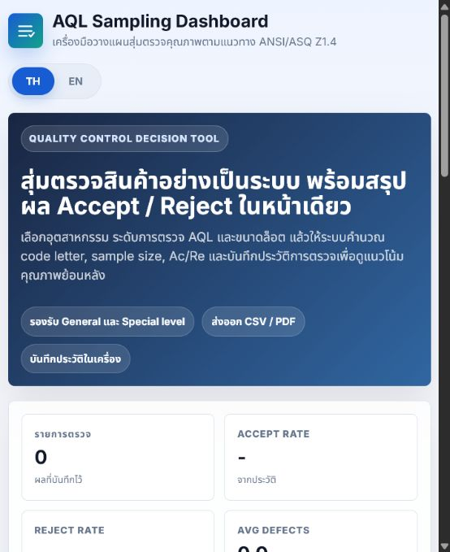

# AQL Sampling Dashboard

## Overview

AQL Sampling Dashboard is an interactive QC tool for calculating inspection sample size, code letter, acceptance number, rejection number, and Accept / Reject decisions for factory quality inspection.

The tool helps quality inspectors reduce manual lookup work, standardize inspection decisions, and keep inspection history in one focused dashboard.

## Use Case

This project is suitable for:

- Incoming quality control (IQC)
- In-process quality control (IPQC)
- Final inspection before shipment
- Supplier quality inspection
- Customer audit preparation
- QC team training
- AQL / sampling decision support

## Features

- AQL level selection
- Inspection level selection
- Lot size and sample size calculation
- Code letter lookup
- Acceptance and rejection number calculation
- Real-time Accept / Reject decision
- Industry presets and recommended inspection settings
- Inspection history for basic trend review
- CSV / PDF export support
- Bilingual Thai / English interface
- Offline-capable single-page web app

## Tech Stack

- HTML
- CSS
- JavaScript
- jsPDF
- GitHub Pages

## Demo

Live Demo: https://thesor55.github.io/aql-sampling-dashboard-/

## Status

Prototype / MVP

## Screenshots

## Standards Reference

- ANSI/ASQ Z1.4: Sampling Procedures and Tables for Inspection by Attributes
- ISO 2859-1: Sampling procedures for inspection by attributes

## Consultant Context

Developed by FutureGreen by Sorawit as a prototype QC / AQL tool for factory inspection, audit readiness, and practical quality-control consulting for Thai SME manufacturers.
